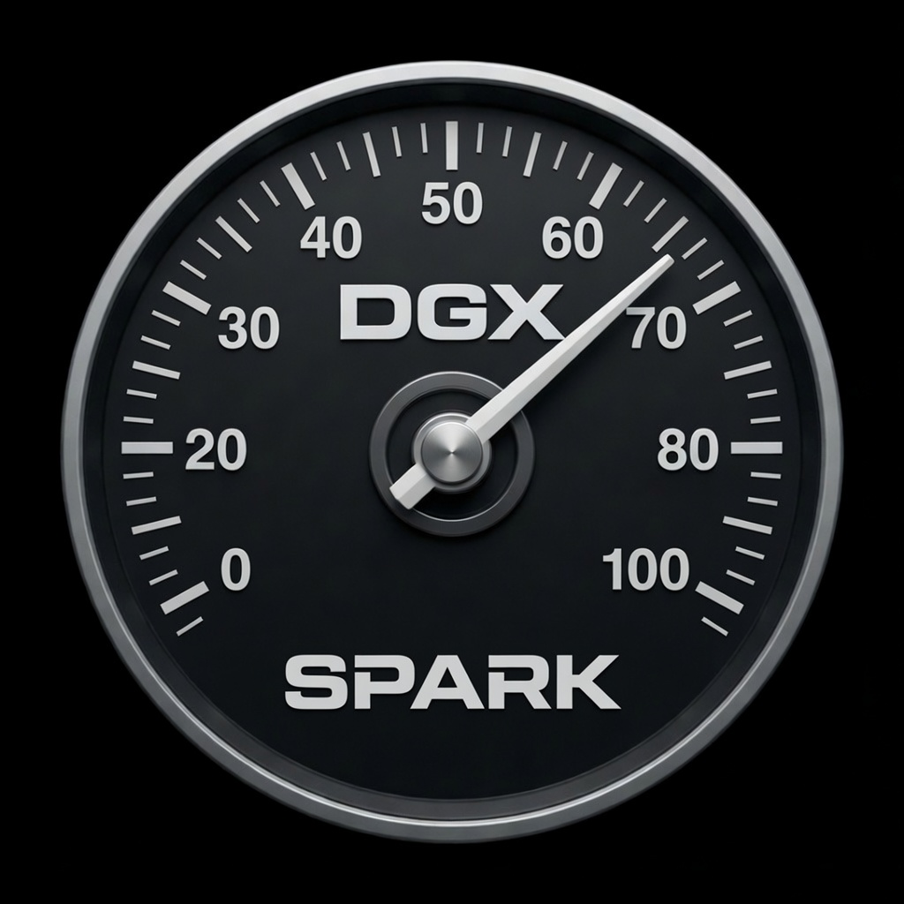

<p align="center">
  
</p>

<h1 align="center">DGX Spark Real-time Monitor</h1>

<p align="center">
  A lightweight, always-on-top desktop GUI for monitoring an
  <strong>NVIDIA DGX Spark (GB10 Grace&nbsp;Blackwell)</strong> in real time.
</p>

---

## Overview

A single-file Python/Tkinter application that shows live system load at a glance with
four circular gauges, a 24-hour history graph, and an expandable panel of detailed
metrics. It reads directly from `nvidia-smi`, `free`, and `/proc` — there are **no
third-party services, agents, or cloud dependencies**, and it is designed to run 24/7
with minimal CPU/GPU overhead.

## Features

- **Four live gauges** — GPU utilization (SM), CPU utilization, unified-memory usage,
  and a derived "CUDA Cores active" estimate (out of 6144 on the GB10).
  - Top-semicircle dials with a grey track, colored fill bar, white needle, and
    reference ticks. Color zones: green `<60%`, amber `60–90%`, red `>90%`.
- **24-hour history graph** — one sample per minute, `0–100%` Y-axis and a fixed
  `1h…24h` X-axis with hourly gridlines. Re-renders dynamically as the window resizes.
- **More Metrics dock** — an expandable 2×2 grid of detail tables:
  - **GPU** — temperature, power draw, SM/graphics clock, performance state,
    memory-bandwidth utilization, encoder/decoder usage.
  - **CPU** — load average (1/5/15m), average frequency, package temperature, core count.
  - **Unified Memory** — total / used / available / buffers-cache / swap
    (sourced from `free`, since `nvidia-smi` reports unified memory as N/A on the Spark).
  - **System** — GPU headroom, GPU utilization, driver version, uptime.
- **Responsive layout** — gauges reflow to a single row on wide windows and 2×2 when narrow.
- **ⓘ tooltips** describing each metric, and a `-topmost` always-on-top window.

## Requirements

- An NVIDIA DGX Spark (or any NVIDIA system with `nvidia-smi`); Linux.
- Python 3 with Tkinter:
  ```bash
  sudo apt install python3-tk
  ```
- `nvidia-smi` available on `PATH` (ships with the NVIDIA driver). The app degrades
  gracefully and shows `N/A` for any metric the platform does not expose.

## Run

```bash
git clone https://github.com/NexGenHealth/DGX_Spark_Real-time_Monitor.git
cd DGX_Spark_Real-time_Monitor
python3 dgx_monitor_gui.py
```

## Desktop launcher (optional)

A `dgx-spark-monitor.desktop` file is included. Edit the `Exec` and `Icon` paths to
match where you cloned the repository, then copy it into your applications directory:

```bash
cp dgx-spark-monitor.desktop ~/.local/share/applications/
```

## Notes

- The history graph is kept in memory (a rolling 24-hour buffer); it resets when the
  app is closed. There is no telemetry and nothing is written off-device.
- The "CUDA Cores active" value is a derived estimate: `GPU utilization % × 6144`.

## License

[MIT](LICENSE) © 2026 NexGenHealth
